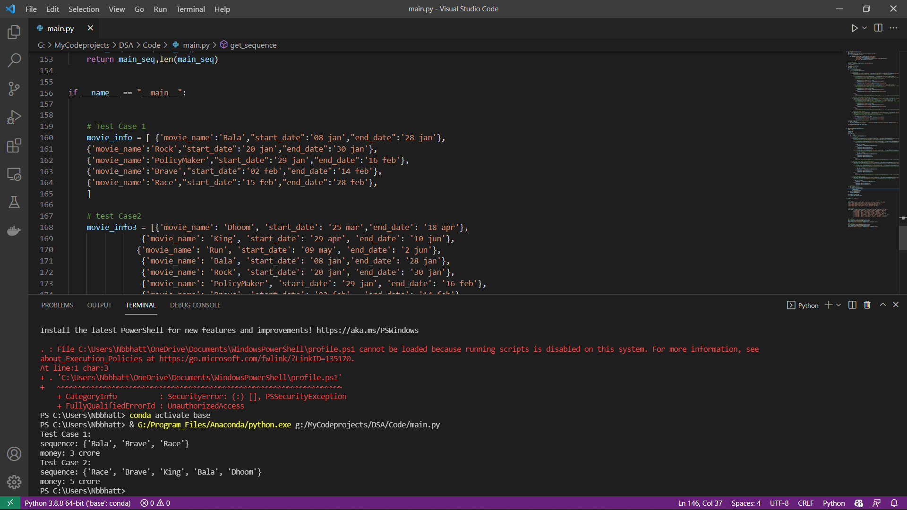

# Software-developer-Intern-Actor-Problem
This problem is solved by simple Brute Force approch. It can be solve by backtracking and Recursion methods.
## My basic approch to solve this problem :
1. Loop for compairing 1st moive with all movie then 2nd to all and so on :
   1. Both movies start and end date same :
        1. Then compair the date , both movie can do same time or not
   2. Both moives start and end date not same :
        1. Then we do not need to compair the dates and we can do movies freely
   3. if 1st moive start and end in same month and 2nd movies start month is same but end month different :
        1. Here then condition if the second movie start after first movie then both can be done.

## screenshot

